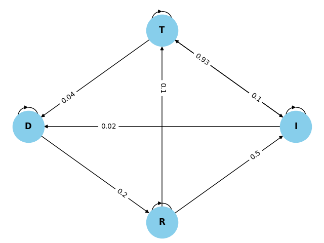

# Matrix-Calculator

### **Developed by:**

+ [Antonio Tresol](https://github.com/Antonio-Tresol)

+ [Luis Solano](https://github.com/GoninDS)


### **Use:**

The following calculator has the following functions:

+ Calculate the `absorption probabilities` of a Markov chain
+ Calculate the `power of a matrix`
+ Solve a `linear equations` system
+ Find the `stable states` of a Markov chain
+ Draw a `graph` of a Markov chain 

Depending on the desired function, the program will require to follow a certain format for a matrix to be inserted into it.

#### **Inserting a matrix to do calculations:**

To insert a matrix for a calculation to be done into the program, create a file containing the amount of rows, columns, and values of the matrix.

An example can be seen below:

```
    3 3
    0.5 0 0.5
    1 0 0
    0 1 0
```

Where the first two values indicate the rows and the columns of the matrix and the rest of the values indicate the matrix itself.

#### **Inserting a matrix to graph it:**

```
    4 4
    I T D R
    0.05 0.93 0.02 0
    0.1 0.86 0.04 0
    0 0 0.8 0.2
    0.5 0.1 0 0.4
```

Where the first two values indicate the rows and the columns of the matrix, the following characters are the names for the states and the rest of the values indicate the matrix itself.

Which produces the resulting graph:




### **Requirements**

+ `Python` installed (tested with Python 3.9.5)
+ `numpy` installed (tested with numpy 1.24.2)
+ `matplotlib` installed (tested with matplotlib 3.7.1)
+ `networkx` installed (tested with networkx 3.1)

To install any of the required Python modules, execute the following command:

```
    pip install (desired_module)
```

Where desired_module refers to `numpy`, `matplotlib` or `networkx`
  